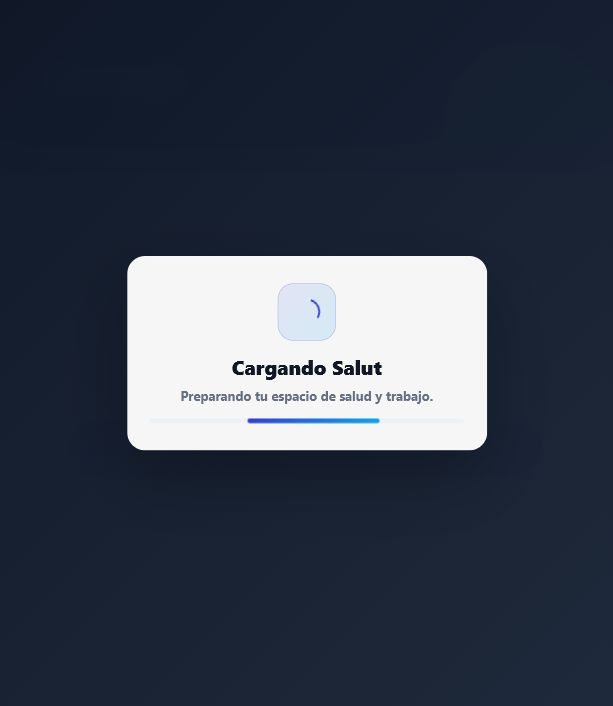
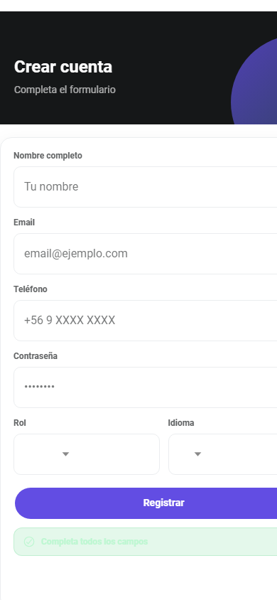
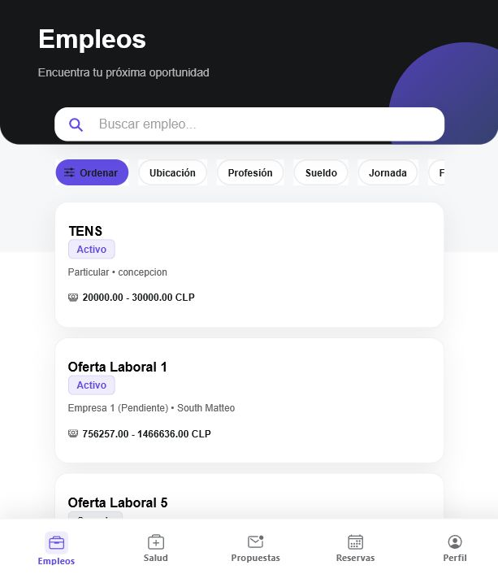
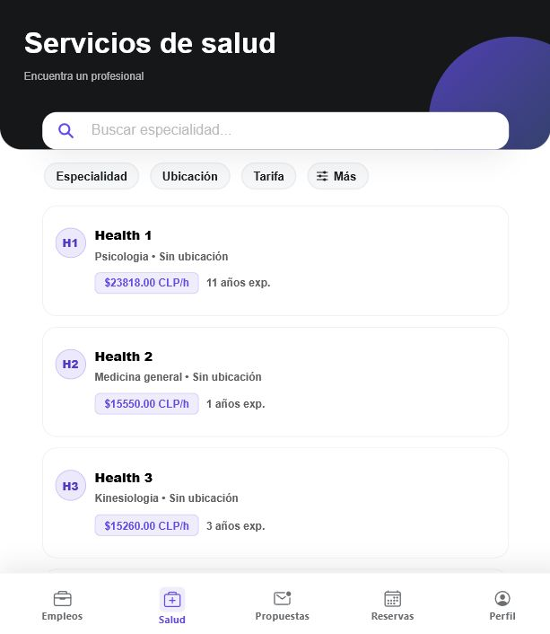
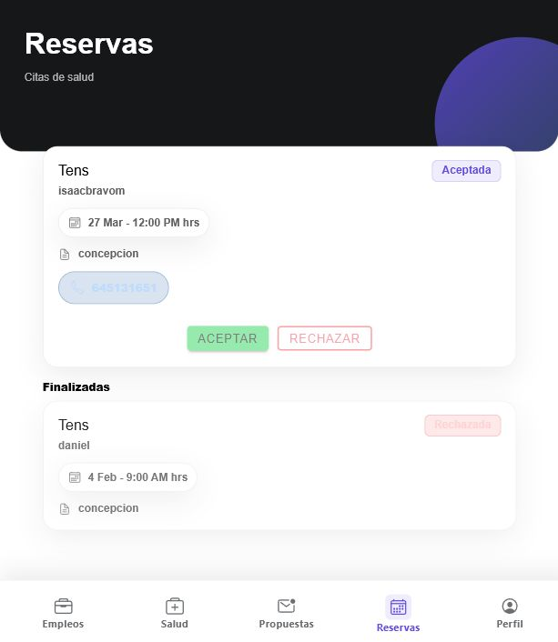
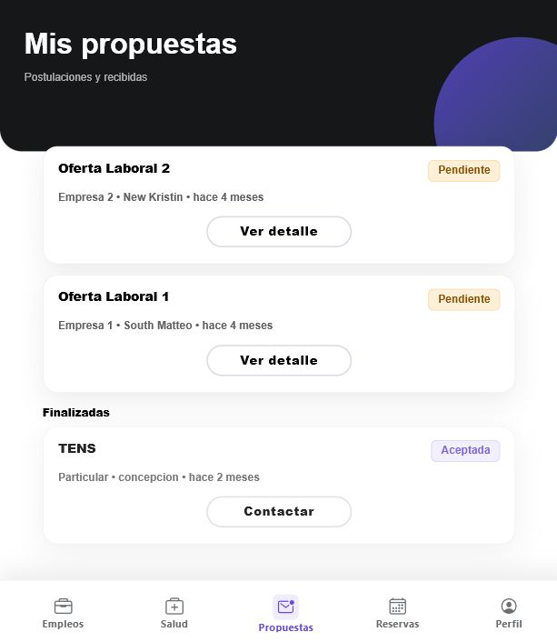
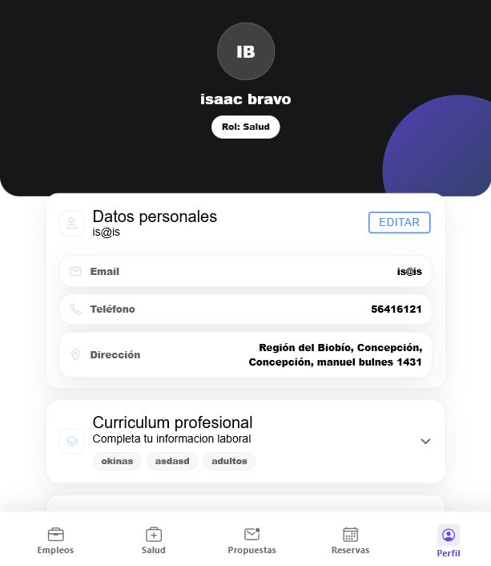

# Salut App

Plataforma digital para conectar personas, profesionales de salud y empresas del area sanitaria en un solo entorno web y movil.

Salut App permite buscar ofertas laborales, publicar oportunidades, postular a empleos, encontrar profesionales de salud, gestionar reservas y mantener el perfil profesional actualizado. El sistema esta construido con un frontend Ionic/Angular y una API REST en Laravel.

## Vista general

Salut App esta pensada para resolver tres necesidades principales:

- Usuarios que buscan servicios de salud o nuevas oportunidades laborales.
- Profesionales de salud que quieren mostrar su perfil, disponibilidad y experiencia.
- Empresas o instituciones que necesitan publicar ofertas y revisar postulaciones.

El proyecto integra autenticacion, roles, reservas, postulaciones, perfiles, servicios de salud y gestion de datos desde una API centralizada.

## Capturas del sistema

### Inicio de sesion

Pantalla de acceso para usuarios registrados. Desde aqui el usuario ingresa con correo y contrasena para acceder a las funciones privadas de la aplicacion.



### Registro de usuarios

Formulario para crear una cuenta nueva. Permite seleccionar el tipo de usuario, idioma y datos basicos de contacto.



### Modulo de empleos

Listado de ofertas laborales con buscador, filtros por ubicacion, profesion, sueldo, jornada, fecha y experiencia. Desde esta vista el usuario puede revisar oportunidades y entrar al detalle de cada publicacion.



### Servicios de salud

Directorio de profesionales disponibles. Incluye filtros por especialidad, ubicacion y tarifa, mostrando informacion relevante como experiencia, profesion y valor por hora.



### Reservas

Panel para revisar citas de salud activas y finalizadas. Permite visualizar fecha, hora, ubicacion, estado de la reserva y acciones segun el rol del usuario.



### Propuestas

Vista de postulaciones enviadas o recibidas. El usuario puede consultar el estado de sus propuestas, revisar detalles y contactar cuando corresponde.



### Perfil

Seccion de datos personales y curriculum profesional. Centraliza informacion de contacto, direccion, rol y antecedentes laborales del usuario.



## Funcionalidades principales

- Registro e inicio de sesion.
- Autenticacion protegida con Laravel Sanctum.
- Roles de usuario, profesional de salud, empresa y administrador.
- Perfil personal y curriculum profesional.
- Publicacion y busqueda de empleos.
- Postulacion a ofertas laborales.
- Busqueda de profesionales de salud.
- Gestion de reservas medicas o servicios domiciliarios.
- Historial de postulaciones y citas.
- API REST para conectar frontend y backend.

## Stack tecnologico

### Frontend

- Angular 20
- Ionic 8
- TypeScript
- SCSS
- Capacitor
- Ionic Storage

### Backend

- PHP 8.2+
- Laravel 12
- Laravel Sanctum
- MySQL
- PHPUnit

## Arquitectura del proyecto

```text
Salut_app/
+-- Backend/
|   +-- api/
|       +-- app/             # Controladores, modelos y providers
|       +-- config/          # Configuracion Laravel
|       +-- database/        # Migraciones, seeders y factories
|       +-- routes/          # Rutas web, consola y API
|       +-- tests/           # Pruebas del backend
+-- Frontend/
|   +-- salutapp/
|       +-- src/app/pages/   # Pantallas principales
|       +-- src/app/services/# Servicios HTTP y estado
|       +-- src/app/guards/  # Proteccion de rutas
|       +-- src/assets/      # Recursos estaticos
+-- docs/
|   +-- images/              # Capturas del README
+-- tools/
+-- README.md
```

## Instalacion local

### Requisitos

- Node.js
- npm
- PHP 8.2 o superior
- Composer
- MySQL

### Backend

```bash
cd Backend/api
composer install
cp .env.example .env
php artisan key:generate
```

Configura la conexion a MySQL en el archivo `.env`:

```env
DB_CONNECTION=mysql
DB_HOST=127.0.0.1
DB_PORT=3306
DB_DATABASE=salutapp
DB_USERNAME=root
DB_PASSWORD=
```

Ejecuta las migraciones y carga datos de prueba:

```bash
php artisan migrate
php artisan db:seed
```

Levanta la API:

```bash
php artisan serve
```

La API queda disponible en:

```text
http://localhost:8000/api
```

### Frontend

```bash
cd Frontend/salutapp
npm install
npm run start
```

La aplicacion queda disponible en:

```text
http://localhost:4200
```

En el entorno de desarrollo, el frontend consume la API desde:

```ts
apiBase: 'http://localhost:8000/api'
```

## Rutas principales del frontend

| Ruta | Descripcion |
| --- | --- |
| `/login` | Inicio de sesion |
| `/register` | Registro de usuarios |
| `/admin` | Panel administrativo |
| `/app/jobs` | Listado de empleos |
| `/app/jobs/new` | Creacion de empleo |
| `/app/jobs/:id` | Detalle de empleo |
| `/app/health` | Busqueda de profesionales de salud |
| `/app/health-bookings` | Reservas de salud |
| `/app/my-proposals` | Propuestas y postulaciones |
| `/app/profile` | Perfil del usuario |

## Endpoints principales de la API

| Metodo | Endpoint | Descripcion |
| --- | --- | --- |
| `POST` | `/api/register` | Crear usuario |
| `POST` | `/api/login` | Iniciar sesion |
| `GET` | `/api/me` | Obtener usuario autenticado |
| `POST` | `/api/logout` | Cerrar sesion |
| `GET/POST` | `/api/jobs` | Listar o crear empleos |
| `POST` | `/api/jobs/{job}/apply` | Postular a un empleo |
| `GET` | `/api/job-applications` | Ver postulaciones |
| `GET/POST` | `/api/health/profiles` | Gestionar perfiles de salud |
| `GET/POST` | `/api/health/bookings` | Gestionar reservas |
| `GET/POST` | `/api/posts` | Gestionar publicaciones sociales |
| `GET/POST` | `/api/chats` | Gestionar conversaciones |
| `GET/POST` | `/api/profile` | Consultar o actualizar perfil |

## Scripts utiles

Frontend:

```bash
npm run start
npm run build
npm run test
npm run lint
```

Backend:

```bash
php artisan serve
php artisan migrate
php artisan db:seed
php artisan test
```

## Estado del proyecto

Proyecto en desarrollo activo. Actualmente cuenta con autenticacion, roles, empleos, postulaciones, servicios de salud, reservas y perfil de usuario.

## Autor

**Isaac Daniel Bravo Melo**  
Ingeniero en Informatica  
Concepcion, Chile  
[isaacbravo1431@gmail.com](mailto:isaacbravo1431@gmail.com)
