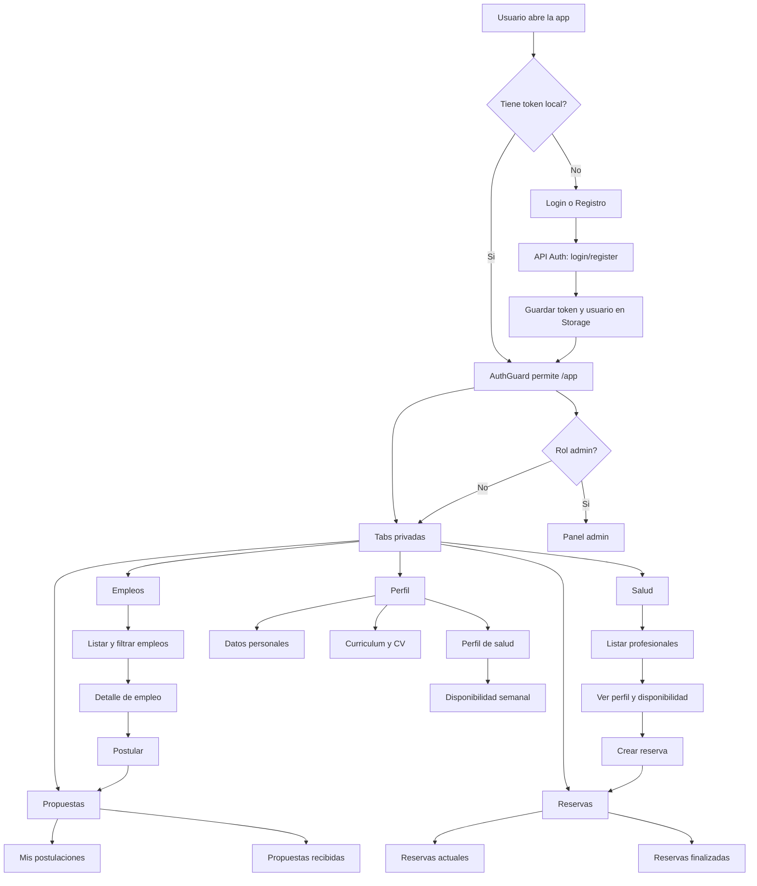
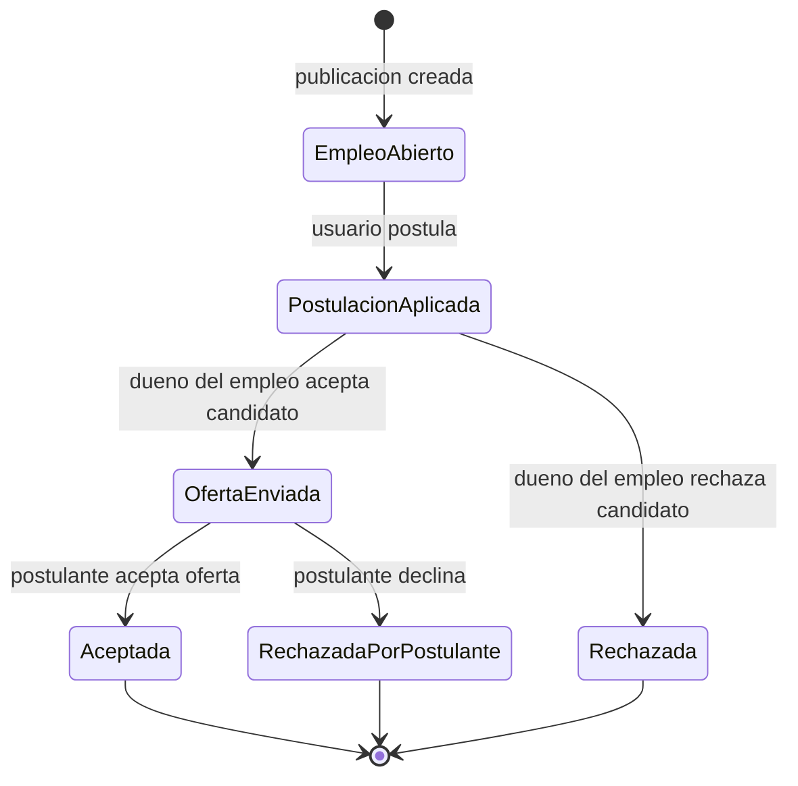
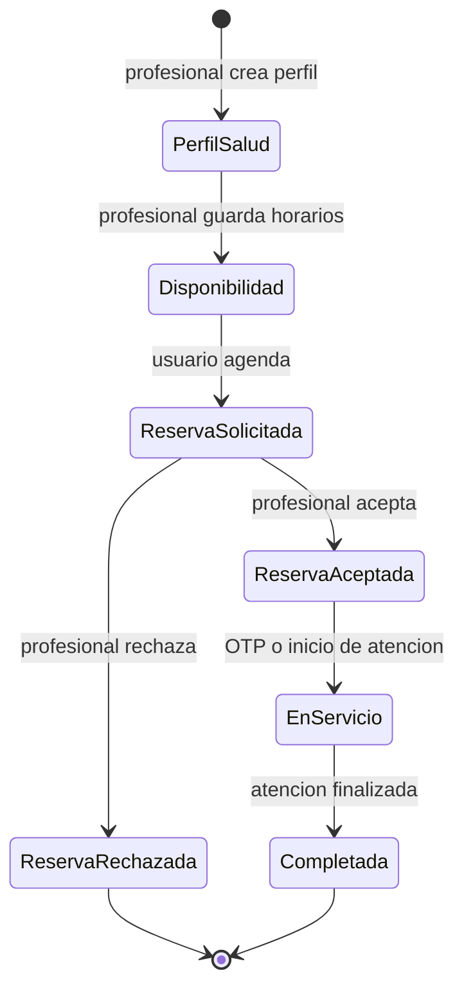
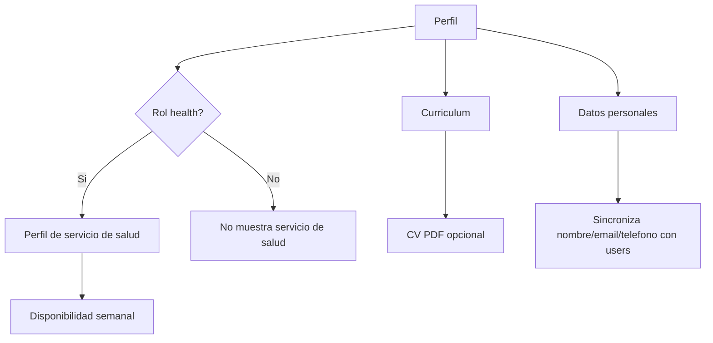

# Flujo actual de Salut App

Este documento resume el flujo real de la aplicacion segun el codigo actual del frontend Ionic/Angular y la API Laravel. Tambien marca los puntos donde la logica esta incompleta, duplicada o puede fallar.

## Estado despues de las correcciones

Corregido en esta iteracion:

- Reservas: el backend ahora valida transiciones por rol.
- Reservas: el backend valida disponibilidad, mismo dia y solapamiento de horarios antes de crear una reserva.
- Reservas: se separo el flujo `requested -> accepted -> in_service -> completed`.
- Reservas: OTP ahora inicia el servicio desde `accepted` hacia `in_service`.
- Reservas: el profesional puede finalizar una reserva en `in_service`.
- Salud: no se puede reservar un profesional no verificado.
- Salud: el listado publico muestra perfiles aprobados y el perfil propio del usuario autenticado.
- Empleos: el dueno de una oferta no puede postular a su propia publicacion.
- Empleos: una postulacion duplicada devuelve `409 Conflict`.
- Verificacion: existen endpoints admin para listar, aprobar y rechazar solicitudes.
- Verificacion: `verification_status` de empresas y perfiles de salud ya no puede cambiarse desde el update normal de usuario.
- Admin: el panel admin carga verificaciones reales y permite aprobar o rechazar.
- Admin: el panel admin carga reportes reales y permite resolver o desestimar.
- Chat: existe tab de conversaciones, lista chats, abre mensajes y permite responder.
- Chat: al confirmar una reserva se crea o reutiliza automaticamente el chat entre cliente y profesional de salud.
- Chat: desde una reserva con contacto visible se puede abrir el chat con la contraparte.
- Auth: `AuthGuard` valida `/me` y el interceptor limpia sesion/redirige en `401`.
- Perfil: la suscripcion a configuracion visual ya no se salta cuando hay usuario guardado en Storage.

Pendiente o fuera de esta iteracion:

- Conectar pagos con reservas o servicios.
- Conectar chat tambien desde propuestas aceptadas.
- Mejorar algunos textos mal codificados heredados en la UI.

## Flujo general



## Flujo de empleos y postulaciones



### Logica correcta

- El usuario autenticado puede listar empleos desde `/app/jobs`.
- El detalle permite postular si el empleo esta `open`.
- La postulacion queda como `applied`.
- El dueno del empleo puede cambiar `applied` a `offered` o `rejected`.
- El postulante puede responder `offered` con `accepted` o `declined`.

### Problemas detectados

| Prioridad | Ubicacion | Problema | Impacto | Correccion sugerida |
| --- | --- | --- | --- | --- |
| Alta | `Backend/api/app/Http/Controllers/JobApplicationController.php:76` | El backend permite que el dueno de un empleo postule a su propio empleo. Solo valida que el empleo este `open`. | Un usuario puede crear una oferta personal o de su empresa y auto-postular. Rompe la logica de postulacion real. | En `store`, resolver el `company.user_id` del empleo y bloquear si coincide con el usuario autenticado, salvo admin si se quiere permitir pruebas. |
| Media | `Backend/api/app/Http/Controllers/JobApplicationController.php:87` | `firstOrCreate` devuelve la postulacion existente como exito y el frontend muestra flujo exitoso igual. | El usuario no distingue entre "postulacion enviada" y "ya habias postulado". | Si ya existe, devolver `409` o un mensaje claro. En frontend mostrar "Ya postulaste a esta oferta". |
| Corregido | `Frontend/salutapp/src/app/pages/my-proposals/my-proposals.page.ts` | Los estados de propuestas ya muestran etiquetas diferenciadas para postulacion, oferta recibida/enviada y finales. | Menos confusion al responder propuestas. | Mantener la misma nomenclatura si se agregan nuevos estados. |

## Flujo de salud y reservas



### Logica correcta

- El usuario `health` puede crear perfil de salud y disponibilidad desde Perfil.
- La pantalla Salud lista profesionales distintos al usuario actual.
- El frontend valida dia y horario contra la disponibilidad antes de crear la reserva.
- El backend oculta direccion y coordenadas al profesional hasta que la reserva este aceptada/en servicio.
- La pantalla Reservas separa estados actuales y finalizados.

### Problemas detectados

| Prioridad | Ubicacion | Problema | Impacto | Correccion sugerida |
| --- | --- | --- | --- | --- |
| Critica | `Backend/api/app/Http/Controllers/HealthBookingController.php:172` | `update` permite a cualquier usuario con acceso a la reserva actualizar `status`. Como `canAccessBooking` incluye al cliente, el cliente podria mandar por API `in_service`, `completed` o `cancelled`. | El cliente puede saltarse al profesional y cambiar estados sensibles. | Crear una matriz de transiciones por rol: cliente solo puede cancelar `requested`; profesional solo acepta/rechaza `requested` y completa `in_service`; admin puede forzar cambios. |
| Alta | `Backend/api/app/Http/Controllers/HealthBookingController.php:86` | El backend crea reservas sin validar disponibilidad real ni choques horarios. Esa validacion esta solo en frontend. | Una llamada directa a la API puede crear reservas fuera del horario o duplicadas. | En `store`, validar `day_of_week`, rango horario y solapamiento contra `health_availabilities` y `bookings`. |
| Alta | `Backend/api/app/Http/Controllers/HealthBookingController.php:203` y `Frontend/salutapp/src/app/pages/health-bookings/health-bookings.page.ts` | Existe endpoint de OTP, pero el frontend acepta reserva directamente con `status = in_service`. | El flujo de OTP queda inconsistente: hay codigo generado, pero no gobierna el inicio de servicio. | Definir una sola regla: `requested -> accepted` al aceptar; luego OTP cambia `accepted -> in_service`; finalmente `completed`. O eliminar OTP si no se usara. |
| Media | `Frontend/salutapp/src/app/pages/health-bookings/health-bookings.page.ts` | No existe accion UI para marcar una reserva como `completed`. | Las reservas aceptadas pueden quedarse indefinidamente en estado actual. | Agregar boton "Finalizar" para profesional cuando la reserva esta `in_service`, con validacion backend. |
| Media | `Frontend/salutapp/src/app/pages/health/health.page.ts:336` | El frontend valida disponibilidad antes de reservar, pero depende de datos cargados en cliente. | La UX esta bien, pero la seguridad/logica real queda incompleta si no se replica en backend. | Mantener validacion en frontend para UX y duplicarla en backend para consistencia. |

## Flujo de perfil



### Logica correcta

- Perfil personal se guarda en `user_profiles`.
- Nombre, email y telefono tambien se sincronizan con `users`, lo que alimenta reservas y propuestas.
- CV se sube como PDF y se expone con `cv_url`.
- Usuario `health` puede mantener perfil profesional y disponibilidad.

### Problemas detectados

| Prioridad | Ubicacion | Problema | Impacto | Correccion sugerida |
| --- | --- | --- | --- | --- |
| Baja | `Frontend/salutapp/src/app/pages/profile/profile.page.ts:320` | Si existe usuario en Storage, `ngOnInit` retorna antes de suscribirse a `uiSettings.settings$`. | La configuracion visual puede no sincronizarse en una sesion normal. | Mover la suscripcion a UI settings al inicio de `ngOnInit`, antes de cualquier `return`. |
| Media | `Backend/api/app/Http/Controllers/HealthProfileController.php:10` | El listado de profesionales muestra todos los perfiles, incluso `verification_status = pending`. | Usuarios pueden reservar profesionales no verificados. | Filtrar publicamente solo `approved` o mostrar una advertencia visible y bloquear reserva hasta aprobar. |

## Flujo de administracion y verificacion

```mermaid
flowchart TD
  A[Usuario admin] --> B[/admin]
  B --> C[Lista verificaciones hardcodeadas]
  B --> D[Lista reportes hardcodeados]
  C --> E[Boton Revisar sin accion real]
  D --> F[Boton Resolver sin accion real]
  G[API verifications] --> H[Solo permite crear solicitud]
```

### Problemas detectados

| Prioridad | Ubicacion | Problema | Impacto | Correccion sugerida |
| --- | --- | --- | --- | --- |
| Alta | `Frontend/salutapp/src/app/pages/admin/admin.page.ts:13` | El panel admin usa arreglos estaticos para verificaciones y reportes. | No administra datos reales. | Crear `AdminService` para consumir verificaciones/reportes reales. |
| Alta | `Backend/api/routes/api.php:55` y `VerificationController.php:10` | Solo existe `POST /verifications`; no hay `GET`, `PUT approve/reject` ni flujo para cambiar `verification_status`. | Los estados `pending` de empresas/profesionales no tienen cierre real. | Agregar endpoints admin: listar, aprobar, rechazar. Al aprobar, actualizar `companies.verification_status` o `health_profiles.verification_status`. |
| Media | `Backend/api/app/Http/Controllers/CompanyController.php:51` | `verification_status` se puede actualizar por el dueno de la empresa, no solo admin. | Una empresa podria autoverificarse por API. | Permitir `verification_status` solo a admin. Para usuarios normales, crear solicitud de verificacion. |

## Modulos presentes pero sin flujo completo en UI

| Modulo | Backend | Frontend actual | Falta |
| --- | --- | --- | --- |
| Pagos | `PaymentController.php:12`, rutas `payments/authorize` y `payments/{payment}/capture` | No se ve pantalla o servicio frontend que lo use | Pantalla de pago, confirmacion, estados y relacion clara con reservas. |
| Chat | `ChatController.php`, `ChatMessageController.php`, tab `/app/chats` | Hay listado, detalle y envio de mensajes. Reservas con contacto visible pueden abrir chat. | Falta enlazar chat desde propuestas aceptadas. |
| Reportes/social | `ReportController.php`, panel admin | Admin puede listar, resolver y desestimar reportes. | Falta pantalla social completa si el modulo social queda dentro del alcance. |
| OTP reserva | `HealthBookingController.php:203` | No hay input/boton en UI para OTP | Definir flujo OTP o retirar esa pieza. |

## Evaluacion general

La app tiene una base logica coherente para:

- Autenticacion.
- Navegacion privada.
- Publicacion y postulacion a empleos.
- Perfil personal y profesional.
- Creacion de reservas.
- Separacion visual de propuestas y reservas por estado.

Pero no esta completamente cerrada a nivel de negocio porque faltan validaciones de servidor y algunos modulos estan solo a medio camino.

## Prioridad recomendada para corregir

1. Proteger transiciones de reservas en backend.
2. Validar disponibilidad y solapamiento de reservas en backend.
3. Definir el flujo real de OTP o quitarlo.
4. Evitar que el dueno del empleo postule a su propia oferta.
5. Completar admin/verificacion con datos reales y permisos correctos.
6. Conectar pagos o sacarlos del alcance publico hasta que esten listos.
7. Mejorar etiquetas de estados en propuestas.
8. Validar token real en `AuthGuard` o con interceptor 401.
